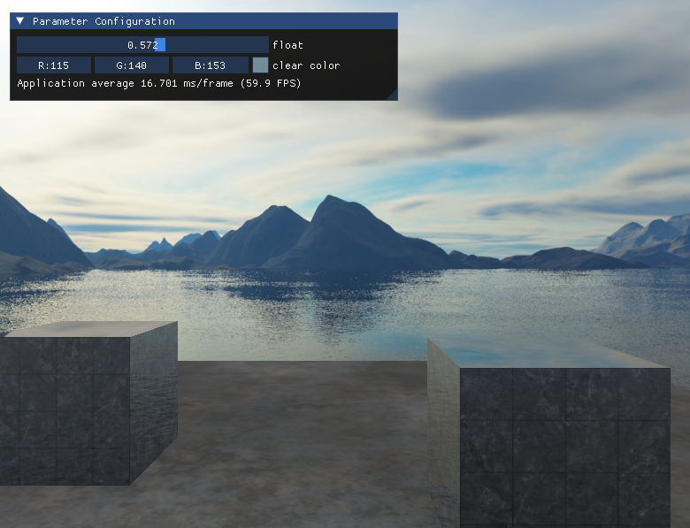
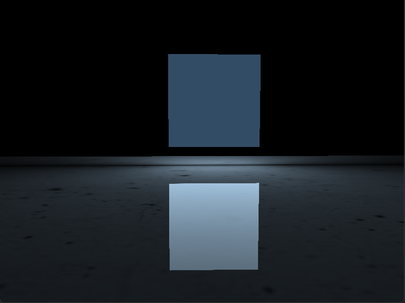
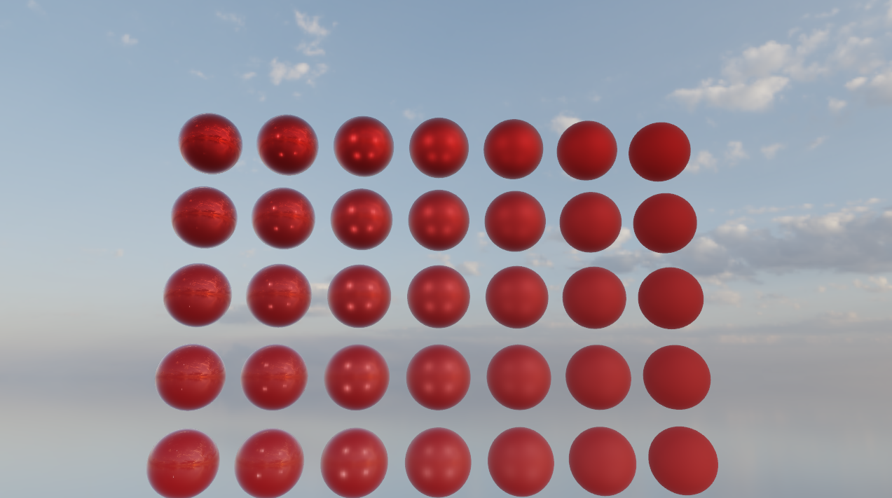

学习记录(Windows 平台(mvsc2019/mvsc2022支持))

环境设置:GLAD/GLFW + CMAKE + MVSC


## 章节对应关系

|                 |                                |
| :-------------: | :----------------------------: |
|  chapter_1.exe  |            MVP变换             |
|  chapter_2.exe  |            基础光照            |
|  chapter_3.exe  |            模型加载            |
| chapter_4_1.exe |           DepthTest            |
| chapter_4_2.exe |          StencilTest           |
| chapter_4_3.exe |           AlphaTest            |
| chapter_4_4.exe |            基础反射            |
| chapter_4_5.exe |            顶点动画            |
| chapter_4_6.exe |          InstanceDraw          |
| chapter_4_7.exe |              MSAA              |
| chapter_5_1.exe |           BlinnPhong           |
| chapter_5_2.exe |        GammaCorrection         |
| chapter_5_3.exe |           ShadowMap            |
| chapter_5_4.exe | Omnidirectional Shadow Mapping |
| chapter_5_5.exe |         Normal Mapping         |
| chapter_6_1.exe |           PBR-Color            |
| chapter_6_2.exe |          HDR-CubeMap           |
| chapter_6_3.exe |              IBL               |
| chapter_6_4.exe |         Test-SubWindow         |
| chapter_6_5.exe |              CSM               |
| chapter_6_6.exe |              CSM               |
| chapter_6_8.exe |           Area-Light           |

## 启动程序
在```bin/Debug(Release)```下启动


## 参考链接

[LearningOpenGL](https://learnopengl-cn.github.io/)

[author：Joey de Vries](http://joeydevries.com/)


<div style="text-align: center;">
  
  <figcaption></figcaption>
</div>

<div style="text-align: center;">
  
  <figcaption></figcaption>
</div>

<div style="text-align: center;">
  
  <figcaption></figcaption>
</div>

