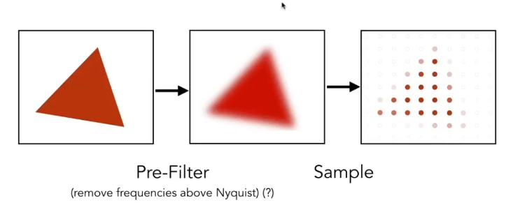

## Anti-Aliasing 反走样技术
### Artifact
采样会导致**Sampling Artifacts**  (Errors/Mistakes/Inaccuracies In Graphics)
> 一个解决方法是预处理(滤波):

### Frequency Domain
**Fourier Transform**: $F(\omega)=\int^{\infty}_{-\infty}f(x)e^{-2\pi i \omega x}dx$
频域的堆叠反应了走样问题

### Solutions

1. 增加采样率
2. Filtering -> Then Sparse Sampling

计算每个像素点的实际像素值(Antialiasing By Supersampling, MSAA):
一个像素点被N个位置覆盖，光栅化时计算每个像素点的位置覆盖率;
MSAA的代价:增加了计算成本
**Milestones**:**FXAA**(*Fast Approximate AA*),**TAA**(*Temporal AA*)
**Super Resolution**:超分,Deep Learning