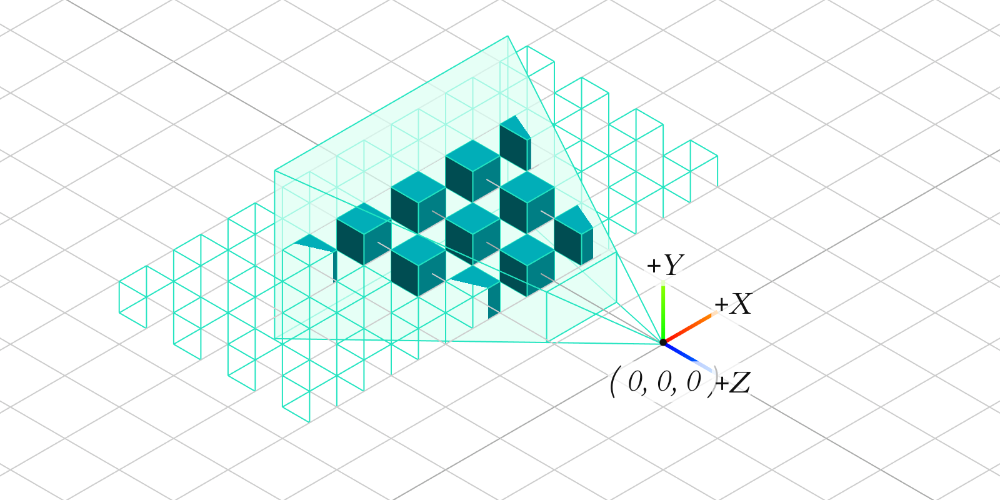
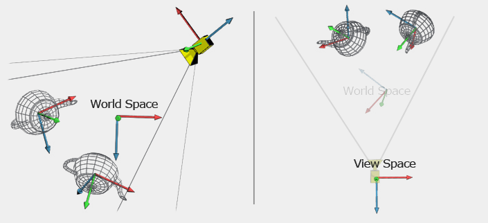
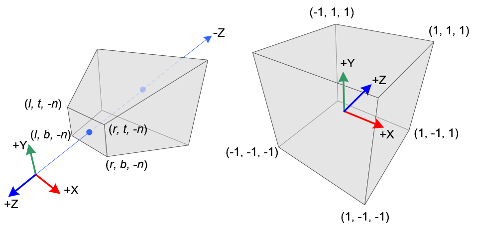
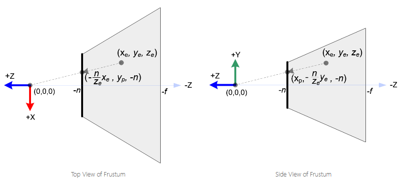

### Model-Transformation
模型，几何物体和网格是一系列顶点的集合。Model变换可以复用这些顶点而不是在每个相同的对象实例化时都给予不同的顶点属性：
$$ M = T\cdot R \cdot S \\ v_{world} = M \cdot v_{model}$$

旋转,平移,变换遵循基本线性代数的运算规则,唯一注意的是所有运算均在拓展齐次坐标下进行,例如:
$$Example_{Scaling} = \begin{bmatrix}
0.5&0&0& 0 \\
0&0.8&0& 0 \\
0&0&1.0& 0\\
0&0&0& 1
\end{bmatrix},
Example_{Transition} = \begin{bmatrix}
1&0&0& t_x \\
0&1&0& t_y \\
0&0&1& t_z\\
0&0&0& 1
\end{bmatrix},

$$
三个坐标下的旋转矩阵为:
$$R_z(\theta)=\begin{bmatrix}
cos\theta&-sin\theta&0& 0 \\
sin\theta&cos\theta&0& 0 \\
0&0&1& 0\\
0&0&0& 1
\end{bmatrix},
R_y(\theta)=\begin{bmatrix}
cos\theta&0&sin\theta&0 \\
0&1&0& 0 \\
-sin\theta&0&cos\theta& 0\\
0&0&0& 1
\end{bmatrix},
R_x(\theta)=\begin{bmatrix}
1&0&0& 0 \\
0&cos\theta&-sin\theta& 0 \\
0&sin\theta&cos\theta& 0\\
0&0&0& 1
\end{bmatrix}
$$

### View-Transformation
视图空间是齐次坐标空间，它的位置通常定义在$(0,0,0)$, 面朝-Z方向:

比较关键的步骤是如何确定摄像机空间？由于摄像机是人为构建的一个对象，它本身不包含顶点。但可以确定的这个虚构的摄像机在世界空间内的位置是$v_{pos}=[x_{camera},y_{camera},z_{camera},1]$。但是，光有一个位置向量还不够，当图像最终渲染到屏幕上，我们不能保证视角的方向(对于同一个位置，可以朝前看，亦可以朝后看)，因此我们额外定义一个上方向$v_{up} = [x_{up},y_{up},z_{up},1]$.

于是,有$v_{z} = v_{pos} - [0,0,0,1]$,$v_{right}=v_{z} \otimes v_{up}$,$\bar{v_{up}}=v_{right} \otimes v_{z}$,于是可以用这正交矩阵$M_{T}$表示摄像机空间的基:
$$
\begin{bmatrix}
R_{x}&R_{y}&R_{z}& 0 \\
U_{x}&U_{y}&U_{z}& 0 \\
Z_{x}&Z_{y}&Z_{z}& 0\\
0&0&0& 1 
\end{bmatrix}
$$
令该矩阵作为摄像机空间的基底，那么视图变换矩阵$M_{view}$为(先平移变换,使新的坐标系原点和旧的世界坐标原点重合,然后乘以摄像机坐标系的基进行坐标变换)):
$$
\begin{bmatrix}
R_{x}&R_{y}&R_{z}& 0 \\
U_{x}&U_{y}&U_{z}& 0 \\
Z_{x}&Z_{y}&Z_{z}& 0\\
0&0&0& 1
\end{bmatrix}
\begin{bmatrix}
1&0&0& -x_{camera} \\
0&1&0& -y_{camera} \\
0&0&1& -z_{camera} \\
0&0&0& 1
\end{bmatrix}
$$

### Projection-Transformation

#### 正交投影 Orthographic Projection

#### 透视投影 Perspective Projection

透视投影的关键是如何将所有平截头体中点映射到近平面的裁剪坐标$c$:

1. 从顶视图观察，内部的x点可经$-\frac{n}{z_e}$映射到近平面,当$z_e=-f$时,该项系数为1,落在远平面,符合我们的观察(y值同理)，基于这一点可以推断映射矩阵中一个项:

$$
\begin{bmatrix}
x_c\\
y_c\\
z_c\\
w_c = -z_e\\
\end{bmatrix}=
\begin{bmatrix}
.&.&.&.\\
.&.&.&.\\
.&.&.&.\\
0&0&-1&0
\end{bmatrix}
\begin{bmatrix}
x_e\\
y_e\\
z_e\\
w_e\\
\end{bmatrix}
$$

2. 将近平面的$x_p$映射到标准坐标空间$x_n$:
$$x_n=\frac{2}{r-l}x_p + \beta \\ \text{代入特殊值},\beta = \frac{r-l}{r-l}-\frac{2r}{r-l}=-\frac{r+l}{r-l}$$

3. 将近平面的$y_p$映射到标准坐标空间$y_n$:
$$y_n=\frac{2}{t-b}y_p + \beta \\ \text{代入特殊值},\beta = \frac{t-b}{t-b}-\frac{2t}{t-b}=-\frac{t+b}{t-b}$$

4.从标准坐标空间中分立出裁剪(Clip)坐标系:
$$x_n=-\frac{2}{r-l}\frac{n}{z_e}x_e-\frac{r+l}{r-l}$$
$$x_n=-\frac{2nx_e}{r-l}/z_e-\frac{(r+l)z_e}{r-l}/z_e$$
$$\text{提取}-z_e,\text{从而,裁剪坐标}x_c=\frac{2nx_e}{r-l}+\frac{(r+l)z_e}{r-l}$$
$$\text{Similarly,裁剪坐标}y_c=\frac{2ny_e}{t-b}+\frac{(t+b)z_e}{t-b}$$
于是,矩阵可更新为(第三行的两个0:由平截头体的透视图发现近平面的Z与X,Y无关得出):
$$
\begin{bmatrix}
x_c\\
y_c\\
z_c\\
w_c\\
\end{bmatrix}=
\begin{bmatrix}
\frac{2n}{r-l}&0&\frac{r+l}{r-l}&0\\
0&\frac{2n}{t-b}&\frac{t+b}{t-b}&0\\
0&0&.&.\\
0&0&-1&0
\end{bmatrix}
\begin{bmatrix}
x_e\\
y_e\\
z_e\\
w_e\\
\end{bmatrix}
$$

4.由平截头体中为齐次坐标的点,可确定$w_e=1$,利用近平面深度-n和-f解出最后两个值,$z_n = Az_e + Bw_e / -z_e = Az_e +b / -z_e$：
$$-1 = -An +B / -n \\1 = -Af + B / -f $$
$$A = \frac{n+f}{n-f},B=An-n = \frac{2nf}{n-f}$$

5.Finally, 

$$
M_{perspective} = \begin{bmatrix}
\frac{2n}{r-l}&0&\frac{r+l}{r-l}&0\\
0&\frac{2n}{t-b}&\frac{t+b}{t-b}&0\\
0&0&\frac{n+f}{n-f}&\frac{2nf}{n-f}\\
0&0&-1&0
\end{bmatrix}
$$

